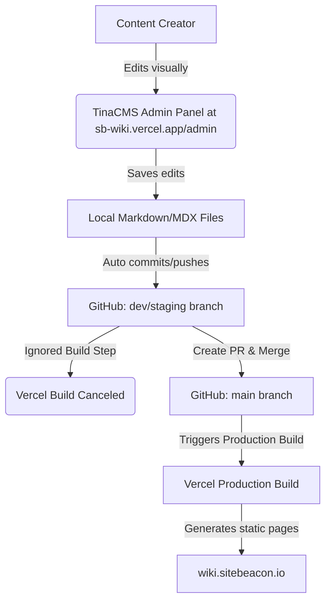

# Implementation Plan — TinaCMS + Fumadocs Content Source Integration

We will implement a hybrid visual content management setup using **TinaCMS** integrated with the **Fumadocs** documentation engine. This provides a visual editor for content writers while ensuring that pages are 100% statically built for maximum performance and zero navigation latency.

---

## 1. Architecture Overview (TinaCMS + Fumadocs Hybrid)

To get the **best output** (fastest page loads, SEO optimization, and instant client-side navigation), we use a hybrid approach:



### Build & Dev Modes

1. **Local Development / Live Preview Mode:**
   - Run `tinacms dev -c "next dev"` to start both the local GraphQL server and Next.js.
   - Pages use the client-side `useTina()` hook (`TinaPageWrapper.tsx`) to dynamically bind variables to the fields in the editor, providing a live visual preview.
2. **Production Build Mode:**
   - During `pnpm build`, the Tina GraphQL API is offline.
   - `createDocsPage.tsx` catches this gracefully and falls back to rendering static page components using Fumadocs' high-performance local MDX files.
   - This results in **0ms backend query times** on production.

---

## 2. Step-by-Step Integration Guide

### Step 2.1: Schema Definition (`tina/config.ts`)

We define collections in `tina/config.ts` matching the four directories under `content/` (`docs`, `learn`, `faq`, `releases`) and map the MDX fields:

- **Collections mapped:**
  - `content/docs` -> `docs`
  - `content/learn` -> `learn`
  - `content/faq` -> `faq`
  - `content/releases` -> `releases`
- **Common Fields:**

  - `title` (String, required, isTitle)
  - `description` (String)
  - `body` (Rich-text, allows custom MDX components like `Card` and `Cards`)

- **Sidebar Navigation Menu Sync:**
  - We add a `menu` collection targeting `**/meta.json` files. This allows editors to drag and drop menu lists to update the sidebar directly from the CMS.

---

### Step 2.2: Dual-Render Setup (`create-docs-page.tsx`)

In `src/lib/create-docs-page.tsx`, we intercept requests:

1. If the local Tina GraphQL server is active, fetch the live data query:
   ```typescript
   const queries = client.queries as unknown as Record<
     string,
     (args: { relativePath: string }) => Promise<unknown>
   >;
   tinaData = await queries[collectionName]({ relativePath });
   ```
2. If `tinaData` exists, render the client-side `<TinaPageWrapper>` for live editing.
3. If it fails (production), render the static `<MDX />` content directly.

---

### Step 2.3: Production build configurations (`package.json`)

The build command must compile Tina schemas locally prior to compiling Next.js:

```json
"scripts": {
  "dev": "tinacms dev -c \"next dev --turbopack\"",
  "build": "if [ -z \"$TINA_TOKEN\" ]; then tinacms build --local; else tinacms build; fi && next build",
  "start": "tinacms build && next start"
}
```

---

### Step 2.4: Custom "Publish" Screen Plugin (`tina/config.ts`)

To allow content editors to publish changes manually directly from the CMS dashboard, we implement a custom screen plugin inside the `cmsCallback` of `defineConfig`:

```tsx
import React, { useState } from 'react';

// Custom screen plugin for one-click Vercel trigger
const PublishScreen = () => {
  const [status, setStatus] = useState<'idle' | 'loading' | 'success' | 'error'>('idle');
  const [errorMsg, setErrorMsg] = useState('');

  const handlePublish = async () => {
    setStatus('loading');
    setErrorMsg('');
    try {
      const hookUrl = process.env.NEXT_PUBLIC_VERCEL_DEPLOY_HOOK_URL;
      if (!hookUrl) throw new Error('NEXT_PUBLIC_VERCEL_DEPLOY_HOOK_URL is not configured.');
      const res = await fetch(hookUrl, { method: 'POST' });
      if (!res.ok) throw new Error(`Server responded with status ${res.status}`);
      setStatus('success');
    } catch (err: any) {
      setStatus('error');
      setErrorMsg(err.message || 'Unknown error occurred.');
    }
  };

  return (
    <div style={{ padding: '40px', maxWidth: '600px', fontFamily: 'sans-serif' }}>
      <h2 style={{ fontSize: '24px', fontWeight: 'bold', marginBottom: '16px' }}>
        Publish to Production
      </h2>
      <p style={{ color: '#666', marginBottom: '24px', lineHeight: '1.5' }}>
        Clicking the button below will trigger a manual build on Vercel for the production
        environment. Your latest saved content updates will be compiled and live-published.
      </p>
      {status === 'success' && (
        <div
          style={{
            padding: '16px',
            backgroundColor: '#e6fffa',
            color: '#006d5b',
            borderRadius: '6px',
            marginBottom: '20px',
            border: '1px solid #b2f5ea',
          }}
        >
          <strong>Success!</strong> Vercel deployment has been successfully triggered. It will take
          a couple of minutes for changes to become live.
        </div>
      )}
      {status === 'error' && (
        <div
          style={{
            padding: '16px',
            backgroundColor: '#fff5f5',
            color: '#c53030',
            borderRadius: '6px',
            marginBottom: '20px',
            border: '1px solid #fed7d7',
          }}
        >
          <strong>Error:</strong> {errorMsg}
        </div>
      )}
      <button
        onClick={handlePublish}
        disabled={status === 'loading'}
        style={{
          padding: '12px 24px',
          fontSize: '16px',
          fontWeight: 'bold',
          color: '#fff',
          backgroundColor: status === 'loading' ? '#cbd5e0' : '#319795',
          border: 'none',
          borderRadius: '6px',
          cursor: status === 'loading' ? 'not-allowed' : 'pointer',
          transition: 'background-color 0.2s',
        }}
      >
        {status === 'loading' ? 'Publishing...' : 'Publish Now 🚀'}
      </button>
    </div>
  );
};
```

This is registered via `cmsCallback` in `tina/config.ts`:

```typescript
cmsCallback: (cms) => {
  cms.plugins.add({
    __type: 'screen',
    name: 'publish-trigger',
    label: 'Publish to Production',
    icon: () => '🚀',
    Component: PublishScreen,
  });
  return cms;
};
```

---

## 3. Dev vs. Production Environment Routing (/admin Exclusion)

For security and content governance, the visual editor panel (`/admin`) should **only be accessible on the dev/staging branch deployment (`sb-wiki.vercel.app`)**, and completely omitted from the production domain (`wiki.sitebeacon.io`).

Since TinaCMS generates the visual editor dashboard as static files inside `public/admin`, we can exclude it during the Vercel build step by deleting the generated directory if Vercel detects a production environment build.

### Script Configuration (`package.json`)

We update the build script to delete `public/admin` immediately after compilation on production:

```json
"scripts": {
  "dev": "tinacms dev -c \"next dev --turbopack\"",
  "build": "if [ -z \"$TINA_TOKEN\" ]; then tinacms build --local; else tinacms build; fi && if [ \"$VERCEL_ENV\" = \"production\" ]; then rm -rf public/admin; fi && next build",
  "start": "tinacms build && next start"
}
```

---

## 4. Preventing Vercel Builds on TinaCMS Auto-Commits (Ignored Build Step)

Since TinaCMS Cloud commits content modifications directly back to Git, it would normally trigger a Vercel build for every saved edit, consuming unnecessary build minutes.

To prevent this, we configure Vercel's **Ignored Build Step** to ignore commits made by the TinaCMS editor bot:

### How to Configure in Vercel Settings:

1. Navigate to your project on Vercel and go to **Settings > Git**.
2. Scroll to the **Ignored Build Step** section.
3. Select **Custom** in the Behavior dropdown.
4. Input the following script command:
   ```bash
   git log -1 --pretty=%B | grep -q "Update from TinaCMS"
   ```

- **How it works:** If the latest commit message contains `"Update from TinaCMS"`, this command exits with status code `0`, signaling Vercel to **cancel and skip** the build. For any regular code commits or manual deployment triggers, it exits with status code `1` and builds normally.

---

## 5. Verification & Deployment Checklist

### Local Validation

- [ ] Run `pnpm dev`.
- [ ] Navigate to `/admin/index.html` and verify you can edit articles and see live previews.
- [ ] Check if editing saves directly to local MDX files in `content/`.

### Production Deployment

- [ ] Add the following environment variables in Vercel:
  - `NEXT_PUBLIC_TINA_CLIENT_ID` (Your Client ID from app.tina.io)
  - `TINA_TOKEN` (Your read-write token from app.tina.io)
- [ ] Set up the **Ignored Build Step** command in Vercel dashboard.
- [ ] Trigger a preview deployment (`sb-wiki.vercel.app`) and check that `/admin` is fully accessible.
- [ ] Trigger a production deployment (`wiki.sitebeacon.io`) and verify that `/admin` returns a **404 Not Found** page.
- [ ] Edit a page via `/admin` and confirm Vercel cancels the triggered build automatically.
