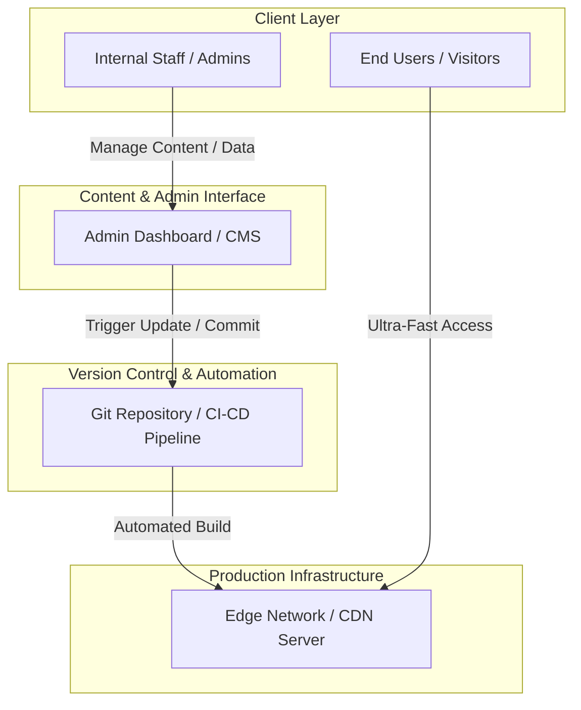

# 🎯 Universal Client Presentation & Project Handover Framework

> **Purpose:** A reusable, professional playbook for presenting, demoing, and handing over software engineering projects to clients, stakeholders, or non-technical business leaders.

---

## 📋 Executive Presentation Checklist

Before starting any client presentation, ensure the following checklist is completed:

- [ ] **Environment Check:** Staging/Production URL is live and tested.
- [ ] **Tab Pre-loading:** Open Frontend, Admin Panel (if applicable), and Architecture Diagram in separate tabs.
- [ ] **Sample Data:** Prepare realistic demo data (avoid `test123` or dummy gibberish text).
- [ ] **Backup Screen Recording:** Keep a short screen recording handy in case of network issues.
- [ ] **Value Alignment:** Focus 70% on **Business Benefits** (speed, security, cost) and 30% on **Tech Details**.

---

## 🎙️ Master Presentation Script (Universal 5-Step Structure)

### Step 1: The Executive Hook (Setting the Context)

**Goal:** Align expectations and highlight the problem you solved.

> _"Hi [Client Name/Team], thank you for joining today._
>
> _Today, I’m excited to present the completion of **[Project Name]**._
>
> _Our primary goal during development was to solve three core business challenges for you:_
>
> 1. **User Experience:** Delivering an ultra-fast, intuitive interface for your end-users.
> 2. **Operational Efficiency:** Making it effortless for your internal team to manage and scale.
> 3. **Security & Maintainability:** Building a resilient, cost-effective infrastructure with zero vendor lock-in.\*
>
> _Let’s walk through the solution step-by-step."_

---

### Step 2: The End-User Experience Demo (The "WOW" Factor)

**Goal:** Demonstrate the polished front-facing application.

> _"Let's start with what your customers and users will see._
>
> _(Share screen: Navigate through key user journeys)_
>
> _- **Performance:** Notice how quickly pages and data load. Navigation happens seamlessly with zero lag._ > _- **Search & Discovery:** (Demonstrate search/filter) Users can find relevant information in milliseconds._ > _- **Responsiveness:** The layout automatically adapts across mobile, tablet, and desktop screens."_

---

### Step 3: The Admin & Management Workflow (Empowering the Team)

**Goal:** Show how easy it is for non-technical team members to manage the platform.

> _"Now, let's switch hats and look at how your internal team manages this platform._
>
> _(Share screen: Open Admin Dashboard / CMS / Back-office)_
>
> _- **Ease of Use:** Your team can manage content/products/data visually without needing developer assistance or writing code._ > _- **Live Preview:** (Demonstrate live edit/preview) As changes are made, you can instantly see how they look before publishing._ > _- **Role & Access Control:** We've ensured that permissions are structured so only authorized team members can approve changes."_

---

### Step 4: System Architecture & Business Benefits

**Goal:** Build technical trust and highlight long-term value.

_(Present the System Architecture Diagram below)_

> _"Behind the scenes, we’ve implemented a modern **[Jamstack / Serverless / Microservices]** architecture._
>
> **_Why this matters for your business:_**
>
> 1. **High Security:** By decoupling the frontend from the backend/database, we eliminate standard security attack vectors.
> 2. **Scalability & Cost Savings:** The infrastructure automatically scales with traffic spikes without requiring expensive dedicated server infrastructure.
> 3. **Ownership & Data Control:** All your data, code, and assets are 100% owned by your team with no proprietary lock-in."\*

---

### Step 5: Wrap-up & Q&A Transition

**Goal:** Smoothly transition into feedback and next steps.

> _"To wrap up, we have delivered a platform that is **fast for your users, simple for your team, and secure for your business**._
>
> _All documentation, access credentials, and source code repositories are prepared for handover._
>
> _I’d love to open the floor to any questions or feedback!"_

---

## 🏗️ Universal System Architecture Diagram Template

Use this Mermaid diagram in your docs/presentation slides to explain system architecture clearly:

---

## 💡 Handling Tough Client Questions (Objection Handling)

| Common Client Question                      | Recommended Response Strategy                                                                                                                                    |
| ------------------------------------------- | ---------------------------------------------------------------------------------------------------------------------------------------------------------------- |
| _"What happens if the system goes down?"_   | _"Our architecture uses redundant Edge Networks (CDNs). Even if a backend component experiences downtime, the cached production application remains live 24/7."_ |
| _"Is this easy for non-tech staff to use?"_ | _"Yes! We specifically chose an intuitive management interface. We can also provide a 15-minute video walkthrough or training session for your team."_           |
| _"Are we locked into a specific service?"_  | _"No. Everything is built on open standards and clean code repositories. You have 100% ownership and can migrate or scale at any time."_                         |
| _"How do we handle security updates?"_      | _"Dependencies are version-locked and managed through automated pipelines, minimizing maintenance overhead."_                                                    |

---

## 📦 Project Handover Checklist

When transferring the project to the client, provide the following artifacts:

1. **Repository Access:** GitHub/GitLab transfer or invite.
2. **Environment Credentials:** Vercel/AWS/Cloud hosting credentials, API keys, and environment variables (`.env.example`).
3. **Admin Credentials:** Super-admin account setup for client team.
4. **Documentation:**
   - Technical Readme (`README.md`)
   - Architecture & Setup Guide
   - Content Editing / Admin User Guide
